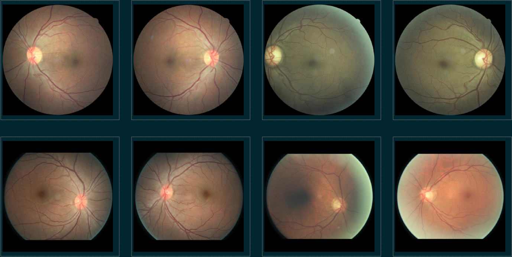
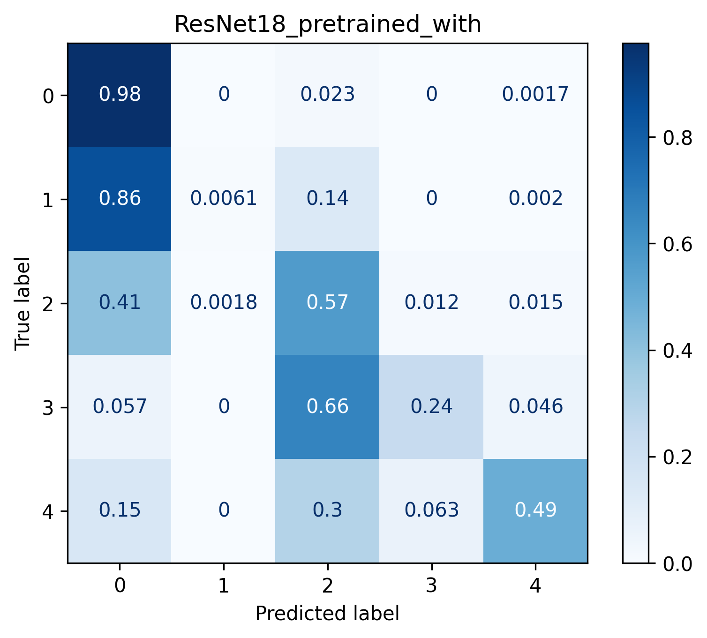
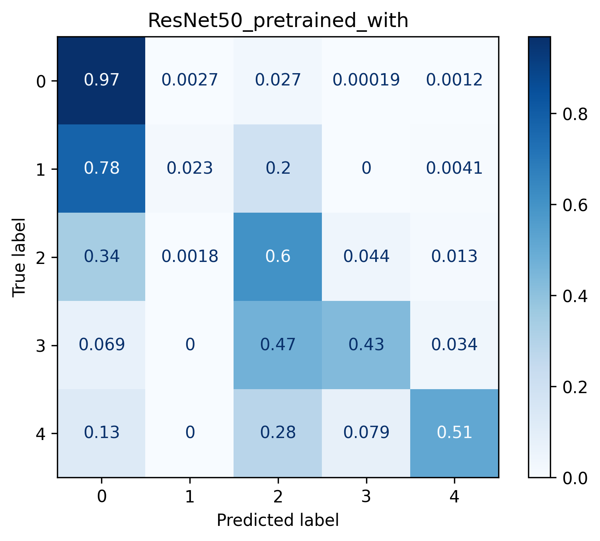
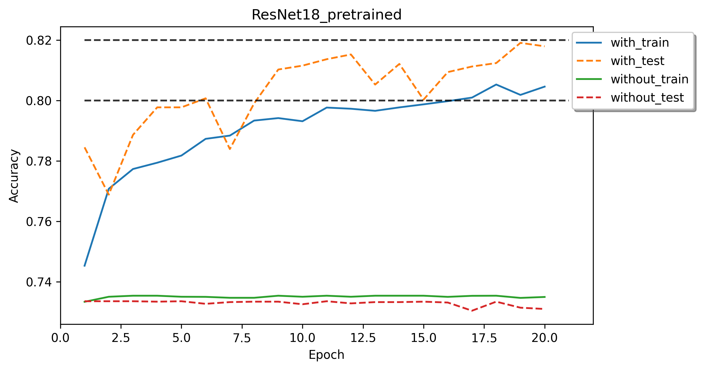
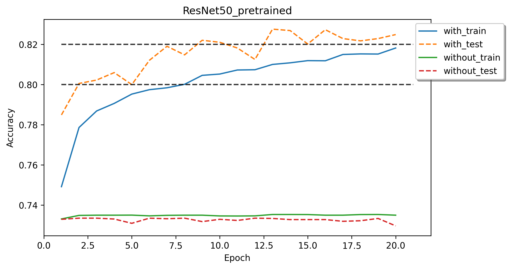
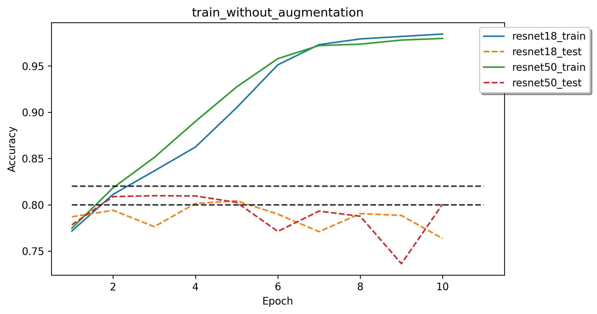

# Lab 3: Diabetic Retinopathy Detection

```
name	  : 周俊川
student id: 310551002
```

## Table of content
- [Lab 3: Diabetic Retinopathy Detection](#lab-3-diabetic-retinopathy-detection)
	- [Table of content](#table-of-content)
	- [Introduction](#introduction)
	- [Experiment setups](#experiment-setups)
			- [The details of model (ResNet)](#the-details-of-model-resnet)
			- [The details of Dataloader](#the-details-of-dataloader)
			- [Evaluation through the confusion matrix](#evaluation-through-the-confusion-matrix)
	- [Experimental results](#experimental-results)
			- [The highest testing accuracy](#the-highest-testing-accuracy)
			- [Comparison figures](#comparison-figures)
	- [Discussion](#discussion)
			- [Effect of data augmentation](#effect-of-data-augmentation)
			- [Implementation of data augmentation](#implementation-of-data-augmentation)
	- [References](#references)


## Introduction

In this lab, I'm going to implement and train diabetic retinopathy classification model by using **ResNet** architecture. The dataset I'm going to use was preprocessed to 512x512 resolution size, containing 28,099 training data and 7,025 testing data, with 5 classes of gradings. Samples are given below.


I have to implement and experiment with the following setups
- implement custom **DataLoader** using **PyTorch** framework for training procedure.
- implement and experiment **ResNet18** and **ResNet50** with / without pretrained weights.
- evaluate performance through confusion matrix.

In the final section, I will discuss effectiveness and implementation details of data augmentation.

## Experiment setups

The implementation module is implemented in **shabririgrape**, including
- `model.py`: implementation of **ResNet** model by leveraging `torchvision`.
- `dataloader.py`: implementation of `RetinopathyDataset` for image loading and preprocessing.
- `trainer.py`: implementation of training and evaluation logic.

I setup a config for hyperparameter experiment in `config` folder, and use `main.py` to execute the experiment for getting the result. The `eval.py` is only use for evaluation. 

#### The details of model (ResNet)

**ResNet** (Residual Network) is the Winner of ILSVRC 2015 in image classification, detection, and localization, as well as Winner of MS COCO 2015 detection, and segmentation [1]. It is been widely used in various of vision task as feature extractor (backbone). I leverage `torchvision` to get the **ResNet18** and **ResNet50** modules as well as its weights for pretrained setup.

```python
def get_model(model_name: str, pretrained_mode: str) -> nn.Module:
    """
    Get model.

    Args:
        model_name (str): Model name.
        pretrained_mode (str): Pretrained mode.

    Raises:
        ValueError: If model_name is not resnet18 or resnet50.

    Returns:
        nn.Module: Model.
    """
    if model_name == MODEL_TYPE.RESNET18:
        weights = None if pretrained_mode == MODEL_TYPE.WITHOUT_PRETRAINED else models.ResNet18_Weights.DEFAULT
        model = models.resnet18(weights=weights)
    elif model_name == MODEL_TYPE.RESNET50:
        weights = None if pretrained_mode == MODEL_TYPE.WITHOUT_PRETRAINED else models.ResNet50_Weights.DEFAULT
        model = models.resnet50(weights=weights)
    else:
        raise ValueError(f'We only allow the following models for experiment: '
                         f'{MODEL_TYPE.RESNET18} and {MODEL_TYPE.RESNET50}')

    if pretrained_mode == MODEL_TYPE.FIXED_PRETRAINED:
        for param in model.parameters():
            param.requires_grad = False

    last_layers = model.fc.in_features
    model.fc = nn.Linear(last_layers, DATASET.NUM_CLASSES)

    return model
```

The pretrained mode is classify as
- `with`: train with pretrained weights with its model architecture (backbone) instead of random weight initialization.
- `without`: train with random weight initialization, also known as train from scratch.
- `fixed`: train with pretrained weights and fixed it during training, update only the classify layer (I will not show this part in below section).

#### The details of Dataloader

I have to implement custom **DataLoader** for dataset, to preprocess the images to fullfill the training criteria. Steps include
- load images and transpose shape if the image shape not include to (channel, height, width)
- divide 255. to scale to (0, 1)
- [optional] add transforms functions (data augmentation)
- normalize image by using **ImageNet** dataset's mean, variance.

```python
class RetinopathyDataset(Dataset):
    def __init__(self, data_container: DRContainer, mode: str, use_aug: bool = False):
        """
        Initialize the dataset.

        Args:
            data_container (DBContainer): Data container.
            mode (str): train or test.
            use_aug (bool): Use augmentation or not. Default is False.
        """
        self.img_name = data_container.x
        self.label = tensor(data_container.y, dtype=torch.long)
        self.mode = mode
        self.device = get_device()
        if use_aug and mode == MODE.TRAIN:
            self.transform = transforms.Compose([
                transforms.RandomResizedCrop(512),
                transforms.RandomHorizontalFlip(),
                transforms.RandomVerticalFlip(),
                transforms.RandomRotation(90),
                transforms.Normalize([0.485, 0.456, 0.406], [0.229, 0.224, 0.225])
            ])
        else:
            self.transform = transforms.Compose([
                transforms.Normalize([0.485, 0.456, 0.406], [0.229, 0.224, 0.225])
            ])

    def __len__(self) -> int:
        """
        Return the length of the dataset.

        Returns:
            int: Length of the dataset.
        """
        return len(self.img_name)

    def __getitem__(self, index: int) -> Tuple[torch.Tensor, torch.Tensor]:
        """
        Get item from the dataset.

        Args:
            index (int): Index of the item.

        Returns:
            tuple[torch.Tensor, torch.Tensor]: Tuple of image and label.
        """
        img_path = self.img_name[index]
        label = self.label[index]
        img = self._load_and_preprocess_image(img_path)

        img_t = self.transform(img)

        return img_t, label

    def _load_and_preprocess_image(self, img_path) -> tensor:
        """
        Load and preprocess image.
        1. Load image by using torchvision.io.read_image.
           It is already [C, H, W] format and move to specific device.
        2. Convert the pixel value to float and [0, 1]

        Args:
            img_path (str): Image path.

        Returns:
            tensor: Preprocessed image.
        """
        img = read_image(img_path, mode=ImageReadMode.RGB).to(self.device)
        return img.float().div(255)

    def get_labels(self) -> torch.Tensor:
        """
        Get labels.

        Returns:
            torch.Tensor: Labels.
        """
        return self.label
```

#### Evaluation through the confusion matrix

I leverage `sklearn`'s confusion matrix to get the result of each training experiment. Instead of observe accuracy and loss only, confusion matrix could give us a global view of performance of the classification model as well as the details of the performance each class, especially when the classes of data were not balanced. It is extremely useful for measuring Recall, Precision, Specificity, Accuracy and most important'y AUC-ROC curve [2]. Below is some examples

|                         ResNet18                          |                         ResNet50                          |
| :-------------------------------------------------------: | :-------------------------------------------------------: |
|  |  |

Both models are relatively weak in classify class 1-5, but ResNet50 should be the better model since each of its class accuracy are better, as well as its global accuracy, which will discuss in next section. 

## Experimental results

I setup the final hyperparameters combination as defaults below

- Parameters
  - batch size: 32
  - epochs: 20
  - learning rate: 0.0001
  - optimizer: adam
  - weight decay: 0.00001
  - use data augmentation

#### The highest testing accuracy

The results show that **ResNet50** achieve the highest accuracy with higher than **82%**. Moreover, with pretrained weights, with data augmentation should gets the higher performance in each backbone models.

| Model                                | with pretrained | without pretrained |
| :----------------------------------- | --------------: | -----------------: |
| ResNet18                             |      **81.79%** |             73.10% |
| ResNet50                             |      **82.49%** |             72.97% |
| ResNet18 (without data augmentation) |          76.36% |                  - |
| ResNet50 (without data augmentation) |          80.07% |                  - |

#### Comparison figures

Both models with pretrained weights show that the increment accuracy trend in train and test. By default I use data augmentation in training for preventing overfitting, the train's accuracy is lower than test, it should be higher if train more longer epochs. Models without pretrained weights cannot be fit well, it should needs more properly setup of hyperparameters for training from scratch.

|                      ResNet18                      |                      ResNet50                      |
| :------------------------------------------------: | :------------------------------------------------: |
|  |  |


## Discussion

#### Effect of data augmentation

By default, I use the data augmentation as follow
- random crop and resize
- random horizontal and vertical flip (50%)
- random rotation with sample in a range (0, 90)

In addition, I also try train models without augmentation, both models are resulting overfitting heavily, hence we should use data augmentation for training while we have limited data.



#### Implementation of data augmentation

Since I work in this experiment by leveraging preprocessing and data augmentation heavily, I found the legacy implementation is worst in throughput. For the setup of batch size 32, I can train 1 batch per second for **ResNet18** in Tesla P100 originally. The latest `torchvision` modules support the transforms function work in GPU [3], hence I refactor it by do processing in GPU in `DataLoader`, I can train 3.5 batch per second with the **speedup of 3.5** in the same setups, which improve the efficiency of the experiments.


## References
[1] https://towardsdatascience.com/review-resnet-winner-of-ilsvrc-2015-image-classification-localization-detection-e39402bfa5d8
[2] https://towardsdatascience.com/understanding-confusion-matrix-a9ad42dcfd62
[3] https://discuss.pytorch.org/t/speed-up-dataloader-using-the-new-torchvision-transforms-support-for-tensor-batch-computation-gpu/113166
